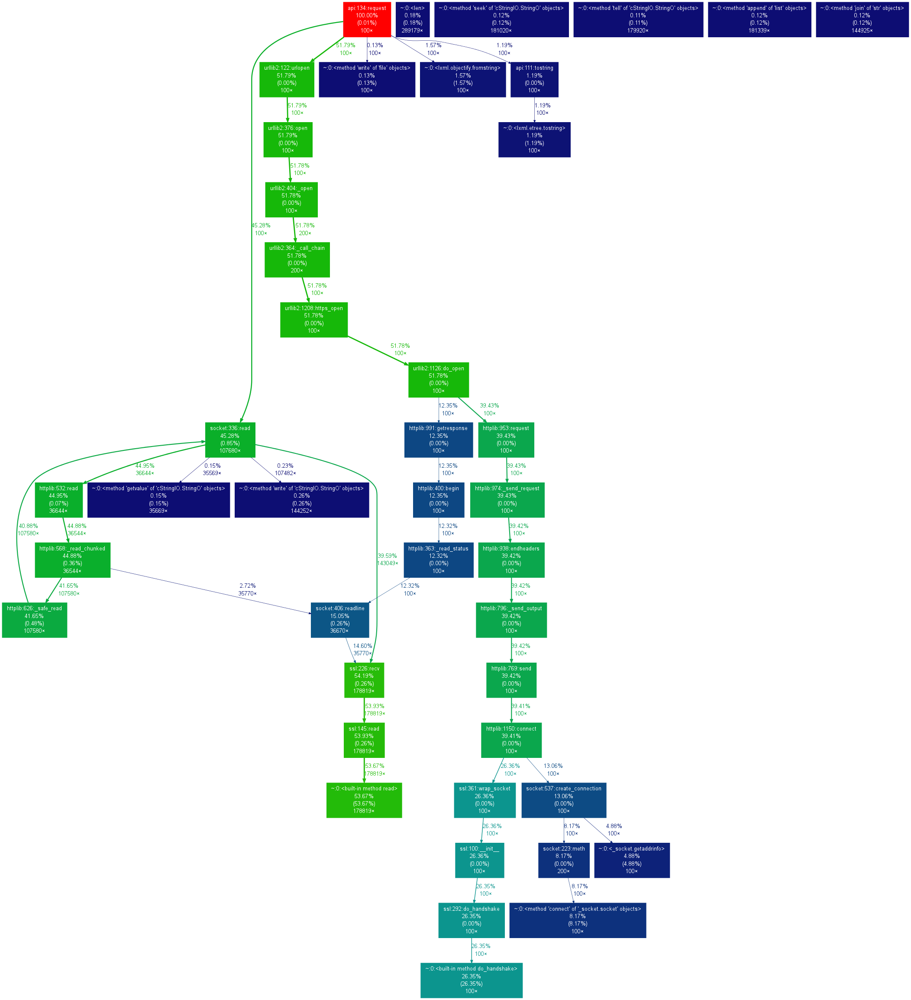
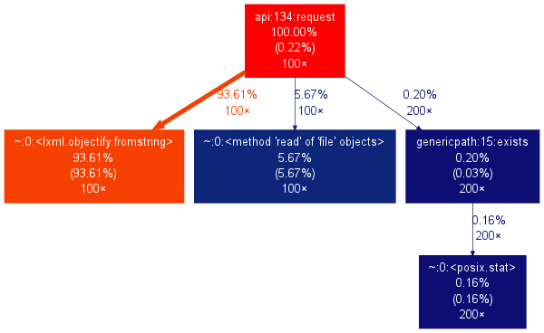
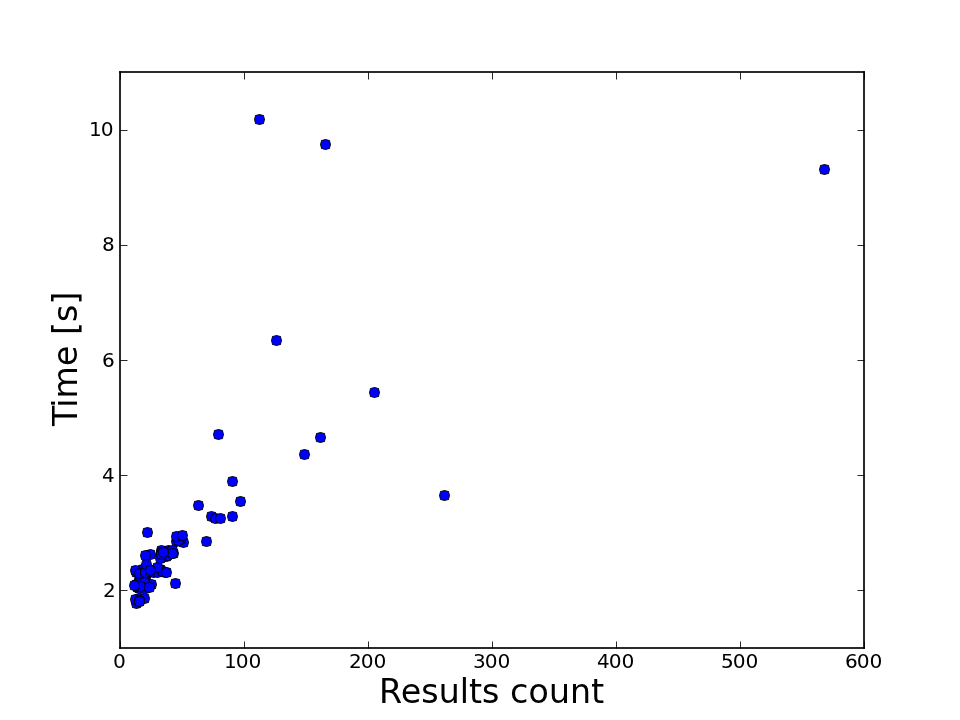

.. About testing

Performance Test Suite
============================================

Setting up dependencies
-----------------------------

All files to run profiling scripts are located in ``devtools/profile``, but some extra dependencies need to be installed.

Gprof2Dot_ utility converts profile files into dot format for visualization in a form of graphs. Get it with ``make get_gprof2dot`` command.

Matplotlib_ is used in another script for plotting. It is not included into the requirements since it is not required for functionality. Install it directly from its site.

Running profiling scripts
----------------------------------------

To run profiling and plotting script also use Makefile targets:

- ``make profile_api`` - to run profiling script (it runs for 100 random queries in the form ``aaa*``, ``aaaa*``)
- ``make profile_api_call_graph`` - plot call graphs
- ``make profile_api_plot`` - plot time versus number of results dependency
- ``make copy_imgs`` - copy images to documentation directory

Results of runs
--------------------

Keep in mind that they depend on geographical location, so you might want to rerun everything and copy images to documentation directory.

Call graphs
~~~~~~~~~~~~~~~

Click images to see them full size. Note that results are hardware dependent.

   Call graph for queries ``aaa*`` when no cache is used. 
   Most of the time is spent in calls to WSI API.

   Call graph for queries ``aaa*`` when cache is used. 
   Time is mostly spent in ``lxml.objectify`` method.

    
Time versus number of results
~~~~~~~~~~~~~~~~~~~~~~~~~~~~~~~~~~

   Time to return results when calls are made to WSI API. There is latency of 2 seconds. 
   This is probably because of call over ocean.

.. figure:: imgs/three_pos_queries_with_cache_plot.png
   :width: 500px
   :align: center
   :target: _images/three_pos_queries_with_cache_plot.png

   Time to return results when queries were cached.

.. _Gprof2Dot: http://code.google.com/p/jrfonseca/wiki/Gprof2Dot
.. _Matplotlib: http://matplotlib.sourceforge.net/

